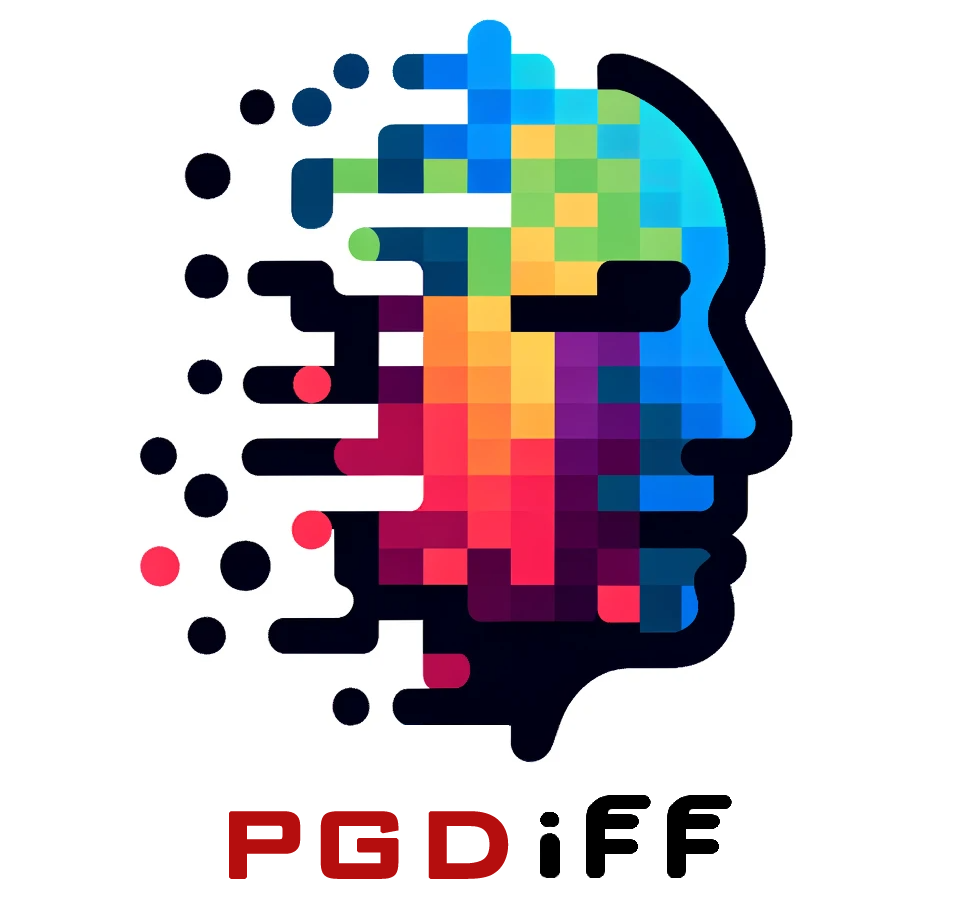
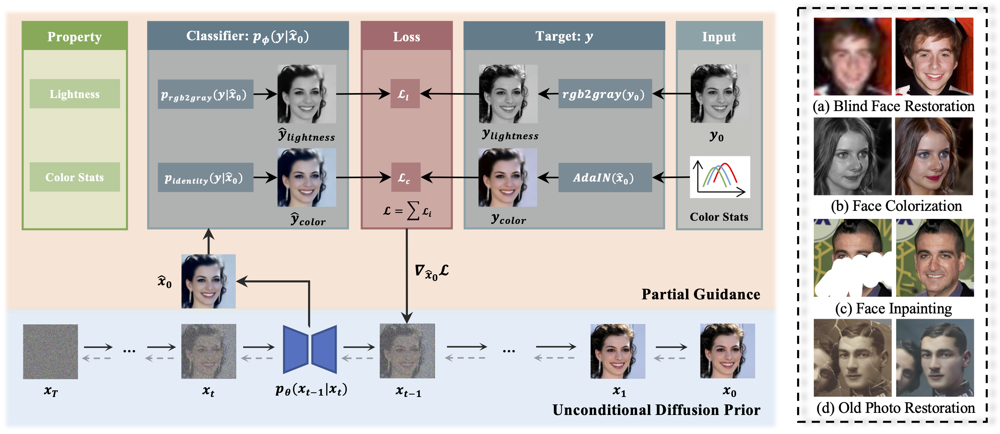
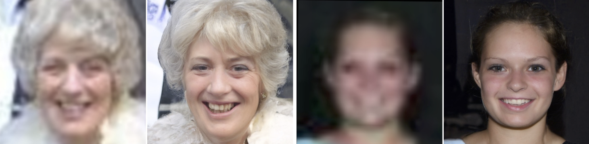
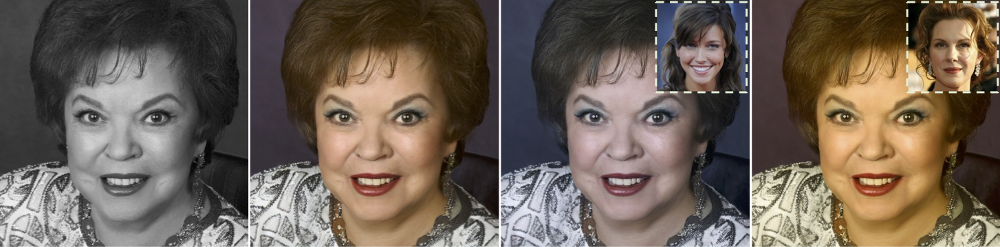
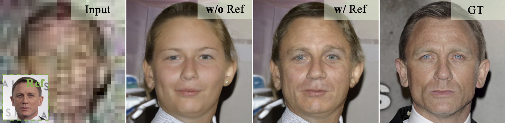
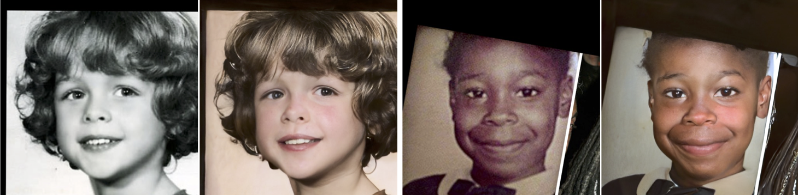
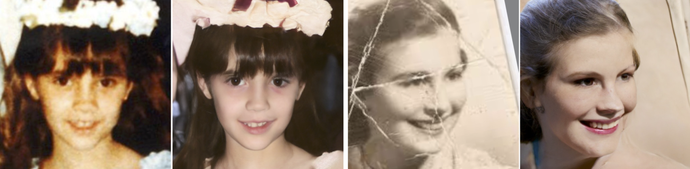
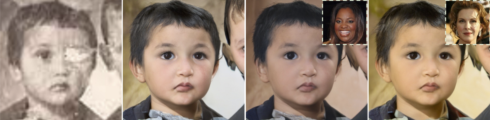

<div align="center">

<div class="logo">
    
</div>

<h1>PGDiff: Guiding Diffusion Models for Versatile Face Restoration via Partial Guidance</h1>

<div>
    <a href='https://pq-yang.github.io/' target='_blank'>Peiqing Yang</a><sup>1</sup>&emsp;
    <a href='https://shangchenzhou.com/' target='_blank'>Shangchen Zhou</a><sup>1</sup>&emsp;
    <a href='https://scholar.google.com.sg/citations?user=fMXnSGMAAAAJ&hl=en' target='_blank'>Qingyi Tao</a><sup>2</sup>&emsp;
    <a href='https://www.mmlab-ntu.com/person/ccloy/' target='_blank'>Chen Change Loy</a><sup>1</sup>
</div>
<div>
    <sup>1</sup>S-Lab, Nanyang Technological University&emsp; 
    <sup>2</sup>SenseTime Research, Singapore&emsp; 
</div>

<div>
    :triangular_flag_on_post: <strong>Accepted to NeurIPS 2023</strong>
</div>

<div>
    <h4 align="center">
        • <a href="https://arxiv.org/abs/2309.10810" target='_blank'>[arXiv]</a> •
    </h4>
</div>



<strong>PGDiff builds a versatile framework that is applicable to a broad range of face restoration tasks.</strong>

<div>
    If you find PGDiff helpful to your projects, please consider ⭐ this repo. Thanks! 😉
</div>

<br/>
:closed_book: <ins>Supported Applications</ins>

<html>
    <table style="margin-left: auto; margin-right: auto;">
        <tr>
            <td>
                <!--left-->
                <li><a href="https://github.com/pq-yang/PGDiff#blind-restoration">Blind Restoration</a></li> 
                <li><a href="https://github.com/pq-yang/PGDiff#colorization">Colorization</a></li> 
                <li><a href="https://github.com/pq-yang/PGDiff#inpainting">Inpainting</a></li> 
            </td>
            <td>
                <!--right-->
                <li><a href="https://github.com/pq-yang/PGDiff#reference-based-restoration">Reference-based Restoration</a></li> 
                <li><a href="https://github.com/pq-yang/PGDiff#old-photo-restoration">Old Photo Restoration (w/ scratches)</a></li> 
                <li>[TODO] Natural Image Restoration</li>
            </td>
        </tr>
    </table>
</html>

---

</div>

## :postbox: Updates
- 2023.12.04: Add an option to speed up the inference process by adjusting the number of denoising steps.
- 2023.10.10: Release our codes and models. Have fun! :yum:
- 2023.08.16: This repo is created.

## :diamonds: Installation

### Codes and Environment

```
# git clone this repository
git clone https://github.com/pq-yang/PGDiff.git
cd PGDiff

# create new anaconda env
conda create -n pgdiff python=3.8 -y
conda activate pgdiff

# install python dependencies
conda install mpi4py
pip3 install -r requirements.txt
pip install -e .
```

### Pretrained Model
Download the pretrained face diffusion model from [[Google Drive](https://drive.google.com/file/d/1kfpLl4JsGxa_8GQXhzt8t38f5tR62uXW/view?usp=sharing) | [BaiduPan (pw: pgdf)](https://pan.baidu.com/s/1VHv48RDUXI8onMEodVFZkw)] to the `models` folder (credit to [DifFace](https://github.com/zsyOAOA/DifFace)).

## :circus_tent: Applications

**:rocket: :rocket: If you want to speed up the inference process, you may choose to shorten the number of DDPM denoising steps by specifying a smaller `--timestep_respacing` argument (*e.g.*, `--timestep_respacing ddpm200` for 200 timesteps). We recommend at least 100 steps for a decent result.**

<h3 id="br">Blind Restoration</h3>

To extract smooth semantics from the input images, download the pretrained restorer from [[Google Drive](https://drive.google.com/file/d/1XlpB873rHCn-T5UfUCXq_fAprhuBKR30/view?usp=sharing) | [BaiduPan (pw: pgdf)](https://pan.baidu.com/s/1IkEnPGDJqFcg4dKHGCH9PQ)] to the `models/restorer` folder. The pretrained restorer provided here is modified from the $\times$ 1 generator of [Real-ESRGAN](https://github.com/xinntao/Real-ESRGAN). *Note that the pretrained restorer can also be flexibly **replaced** with other restoration models by modifying the `create_restorer` function and specifying your own `--restorer_path` accordingly.*

#### Commands

Guidance scale $s$ for BFR is generally taken from [0.05, 0.1]. Smaller $s$ tends to produce a higher-quality result, while larger $s$ yields a higher-fidelity result.

For cropped and aligned faces (512x512):
```
python inference_pgdiff.py --task restoration --in_dir [image folder] --out_dir [result folder] --restorer_path [restorer path] --guidance_scale [s] --timestep_respacing ddpm[steps]
```

Example:
```
python inference_pgdiff.py --task restoration --in_dir testdata/cropped_faces --out_dir results/blind_restoration --guidance_scale 0.05
```




<h3 id="col">Colorization</h3>

We provide a set of color statistics in the `adaptive_instance_normalization` function as the default colorization style. *One may change the colorization style by running the script `scripts/color_stat_calculation.py` to obtain target statistics (avg mean & avg std) and replace those in the `adaptive_instance_normalization` function.*

#### Commands

For cropped and aligned faces (512x512):
```
python inference_pgdiff.py --task colorization --in_dir [image folder] --out_dir [result folder] --lightness_weight [w_l] --color_weight [w_c] --guidance_scale [s] --timestep_respacing ddpm[steps]
```

Example:

:rainbow: Try different color styles for various outputs!
```
# style 0 (default)
python inference_pgdiff.py --task colorization --in_dir testdata/grayscale_faces --out_dir results/colorization --guidance_scale 0.01

# style 1 (uncomment line 272-273 in `guided_diffusion/script_util.py`)
python inference_pgdiff.py --task colorization --in_dir testdata/grayscale_faces --out_dir results/colorization_style1 --guidance_scale 0.01

# style 3 (uncomment line 278-279 in `guided_diffusion/script_util.py`)
python inference_pgdiff.py --task colorization --in_dir testdata/grayscale_faces --out_dir results/colorization_style3 --guidance_scale 0.01
```




<h3 id="inp">Inpainting</h3>

A folder for mask(s) `mask_dir` must be specified with each mask image name corresponding to each input (masked) image. Each input mask shoud be a binary map with white pixels representing masked regions (refer to `testdata/append_masks`). *We also provide a script `scripts/irregular_mask_gen.py` to randomly generate irregular stroke masks on input images.*

**:exclamation: Note: If you don't specify `mask_dir`, we will automatically treat the input image as if there are no missing pixels.**

#### Commands

For cropped and aligned faces (512x512):
```
python inference_pgdiff.py --task inpainting --in_dir [image folder] --mask_dir [mask folder] --out_dir [result folder] --unmasked_weight [w_um] --guidance_scale [s] --timestep_respacing ddpm[steps]
```

Example:

:rainbow: Try different seeds for various outputs!
```
python inference_pgdiff.py --task inpainting --in_dir testdata/masked_faces --mask_dir testdata/append_masks --out_dir results/inpainting --guidance_scale 0.01 --seed 4321
```


<h3 id="rr">Reference-based Restoration</h3>

To extract identity features from both the reference image and the intermediate results, download the pretrained [ArcFace](https://insightface.ai/arcface) model from [[Google Drive](https://drive.google.com/file/d/11l24OkqWWEm3OLNdUFA7StulJZ_m4pEX/view?usp=sharing) | [BaiduPan (pw: pgdf)](https://pan.baidu.com/s/1Ku-d57YYavAuScTFpvaP3Q)] to the `models` folder.

A folder for reference image(s) `ref_dir` must be specified with each reference image name corresponding to each input image. A reference image is suggested to be a high-quality image from the same identity as the input low-quality image. *Test image pairs we provided here are from the [CelebRef-HQ](https://github.com/csxmli2016/DMDNet#celebref-hq-dataset) dataset.*


#### Commands

Similar to blind face restoration, reference-based restoration requires to tune the guidance scale $s$ according to the input quality, which is generally taken from [0.05, 0.1].

For cropped and aligned faces (512x512):
```
python inference_pgdiff.py --task ref_restoration --in_dir [image folder] --ref_dir [reference folder] --out_dir [result folder] --ss_weight [w_ss] --ref_weight [w_ref] --guidance_scale [s] --timestep_respacing ddpm[steps]
```

Example:
```
# Choice 1: MSE Loss (default)
python inference_pgdiff.py --task ref_restoration --in_dir testdata/ref_cropped_faces --ref_dir testdata/ref_faces --out_dir results/ref_restoration_mse --guidance_scale 0.05 --ref_weight 25

# Choice 2: Cosine Similarity Loss (uncomment line 71-72)
python inference_pgdiff.py --task ref_restoration --in_dir testdata/ref_cropped_faces --ref_dir testdata/ref_faces --out_dir results/ref_restoration_cos --guidance_scale 0.05 --ref_weight 1e4
```




<h3 id="op">Old Photo Restoration</h3>

- If scratches exist, a folder for mask(s) `mask_dir` must be specified with the name of each mask image corresponding to that of each input image. Each input mask shoud be a binary map with white pixels representing masked regions. *To obtain a scratch map automatically, we recommend using the [scratch detection model](https://github.com/microsoft/Bringing-Old-Photos-Back-to-Life#2-scratch-detection) from [Bringing Old Photo Back to Life](https://github.com/microsoft/Bringing-Old-Photos-Back-to-Life). One may also generate or adjust the scratch map with an image editing app (e.g., Photoshop).*

- If scratches don't exist, set the `mask_dir` augment as `None` (default). As a result, if you don't specify `mask_dir`, we will automatically treat the input image as if there are no missing pixels.

#### Commands

For cropped and aligned faces (512x512):
```
python inference_pgdiff.py --task old_photo_restoration --in_dir [image folder] --mask_dir [mask folder] --out_dir [result folder] --op_lightness_weight [w_op_l] --op_color_weight [w_op_c] --guidance_scale [s] --timestep_respacing ddpm[steps]
```

#### Demos

Similar to blind face restoration, old photo restoration is a more complex task (restoration + colorization + inpainting) that requires to tune the guidance scale $s$ according to the input quality. Generally，$s$ is taken from [0.0015, 0.005]. Smaller $s$ tends to produce a higher-quality result, while larger $s$ yields a higher-fidelity result.

##### :fire: Degradation: Light
```
# no scratches (don't specify mask_dir)
python inference_pgdiff.py --task old_photo_restoration --in_dir testdata/op_cropped_faces/lg --out_dir results/op_restoration/lg --guidance_scale 0.004 --seed 4321
```


##### :fire::fire: Degradation: Medium
```
# no scratches (don't specify mask_dir)
python inference_pgdiff.py --task old_photo_restoration --in_dir testdata/op_cropped_faces/med --out_dir results/op_restoration/med --guidance_scale 0.002 --seed 1234

# with scratches
python inference_pgdiff.py --task old_photo_restoration --in_dir testdata/op_cropped_faces/med_scratch --mask_dir testdata/op_mask --out_dir results/op_restoration/med_scratch --guidance_scale 0.002 --seed 1111
```


##### :fire::fire::fire: Degradation: Heavy

```
python inference_pgdiff.py --task old_photo_restoration --in_dir testdata/op_cropped_faces/hv --mask_dir testdata/op_mask --out_dir results/op_restoration/hv --guidance_scale 0.0015 --seed 4321
```

**:rainbow: Customize your results with different color styles!**
```
# style 1 (uncomment line 272-273 in `guided_diffusion/script_util.py`)
python inference_pgdiff.py --task old_photo_restoration --in_dir testdata/op_cropped_faces/hv --mask_dir testdata/op_mask --out_dir results/op_restoration/hv_style1 --guidance_scale 0.0015 --seed 4321

# style 2 (uncomment line 275-276 in `guided_diffusion/script_util.py`)
python inference_pgdiff.py --task old_photo_restoration --in_dir testdata/op_cropped_faces/hv --mask_dir testdata/op_mask --out_dir results/op_restoration/hv_style2 --guidance_scale 0.0015 --seed 4321
```



## :thumbsup: Citation
If you find our work useful for your research, please consider citing:
```
@inproceedings{yang2023pgdiff,
  title={{PGDiff}: Guiding Diffusion Models for Versatile Face Restoration via Partial Guidance},
  author={Yang, Peiqing and Zhou, Shangchen and Tao, Qingyi and Loy, Chen Change},
  booktitle={NeurIPS},
  year={2023}
}
```

## :point_right: License
This project is licensed under <a rel="license" href="https://github.com/pq-yang/PGDiff/blob/master/LICENSE">NTU S-Lab License 1.0</a>. Redistribution and use should follow this license.


## :clap: Acknowledgement
This study is supported under the RIE2020 Industry Alignment Fund – Industry Collaboration Projects (IAF-ICP) Funding Initiative, as well as cash and in-kind contribution from the industry partner(s).

This implementation is based on [guided-diffusion](https://github.com/openai/guided-diffusion). We also adopt the pretrained face diffusion model from [DifFace](https://github.com/zsyOAOA/DifFace), the pretrained identity feature extraction model from [ArcFace](https://insightface.ai/arcface), and the restorer backbone from [Real-ESRGAN](https://github.com/xinntao/Real-ESRGAN). Thanks for their awesome works!

## :phone: Contact
If you have any questions, please feel free to reach out at `peiqingyang99@outlook.com`.

