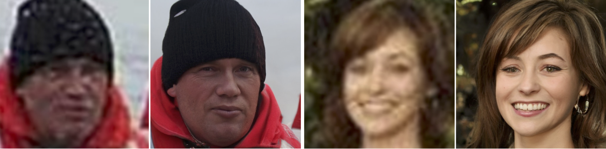
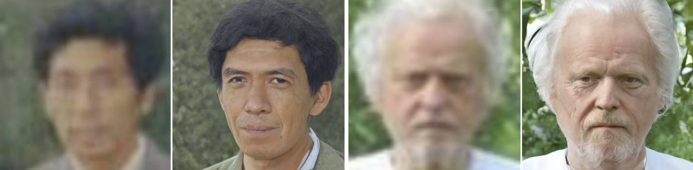
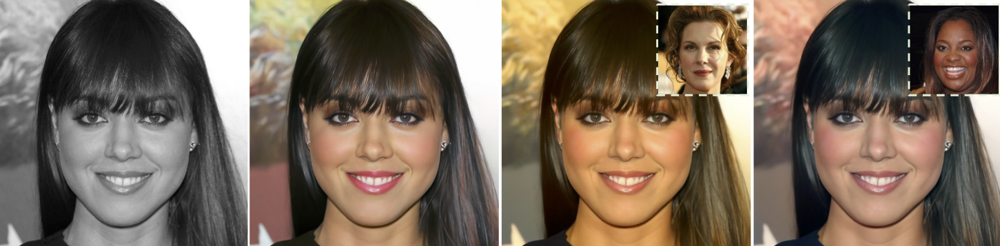
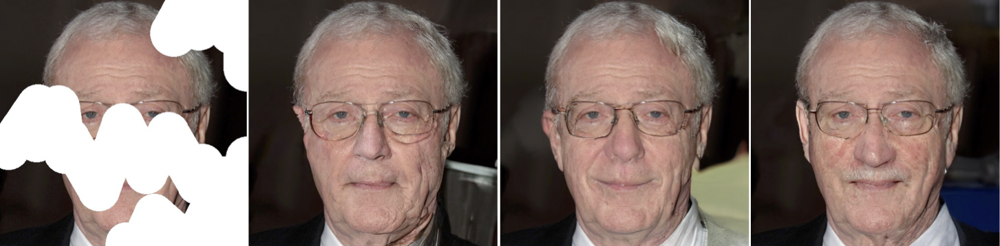
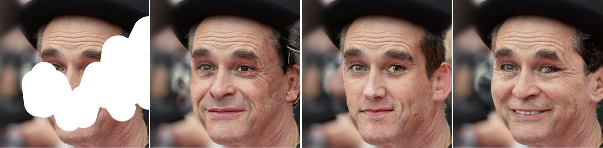
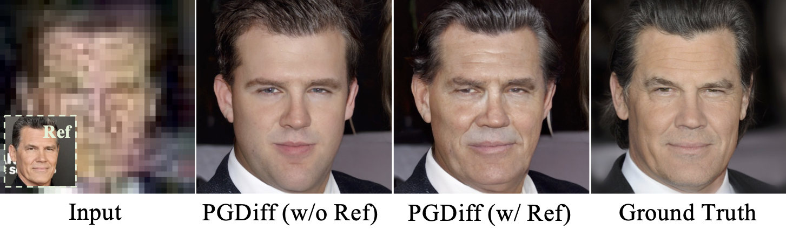
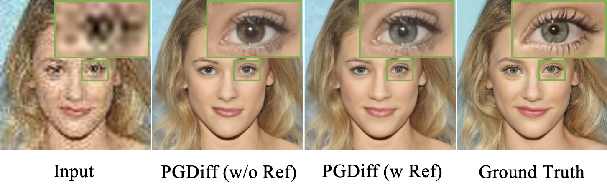
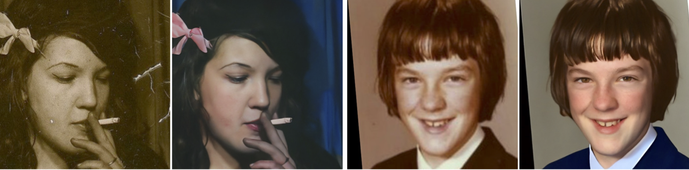
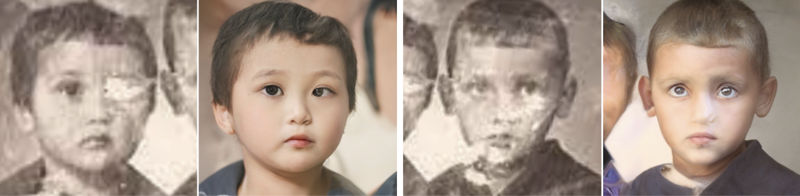

<h1>PGDiff: Guiding Diffusion Models for Versatile Face Restoration via Partial Guidance</h1>

    <a href='https://github.com/pq-yang/' target='_blank'>Peiqing Yang</a>1&emsp;
    <a href='https://shangchenzhou.com/' target='_blank'>Shangchen Zhou</a>1&emsp;
    <a href='https://scholar.google.com.sg/citations?user=fMXnSGMAAAAJ&hl=en' target='_blank'>Qingyi Tao</a>2&emsp;
    <a href='https://www.mmlab-ntu.com/person/ccloy/' target='_blank'>Chen Change Loy</a>1

    1S-Lab, Nanyang Technological University&emsp; 
    2SenseTime Research, Singapore&emsp; 

    <h4 align="center">
        • <a href="https://arxiv.org/list/cs.CV/recent" target='_blank'>[arXiv]</a> •
    </h4>

<strong>PGDiff builds a versatile framework that is applicable to a broad range of face restoration tasks.</strong>

:closed_book: <ins>Supported Applications</ins>

<html>
    <table style="margin-left: auto; margin-right: auto;">
        <tr>
            <td>
                <!--left-->
                <li>Blind Restoration</li> 
                <li>Colorization</li>
                <li>Inpainting</li>
            </td>
            <td>
                <!--right-->
                <li>Reference-based Restoration</li>
                <li>Old Photo Restoration (w/ scratches)</li>
                <li>[TODO] Natural Image Restoration</li>
            </td>
        </tr>
    </table>
</html>

---

## :postbox: Updates
- 2023.8.23: Since our paper is under review, we will make the codes and models available upon acceptance. Please stay tuned! :bowtie:
- 2023.08.16: This repo is created.

## :circus_tent: Applications

### Blind Restoration

### Colorization

### Inpainting

### Reference-based Restoration

### Old Photo Restoration

## :phone: Contact
If you have any questions, please feel free to reach out at `peiqingyang99@outlook.com`.

